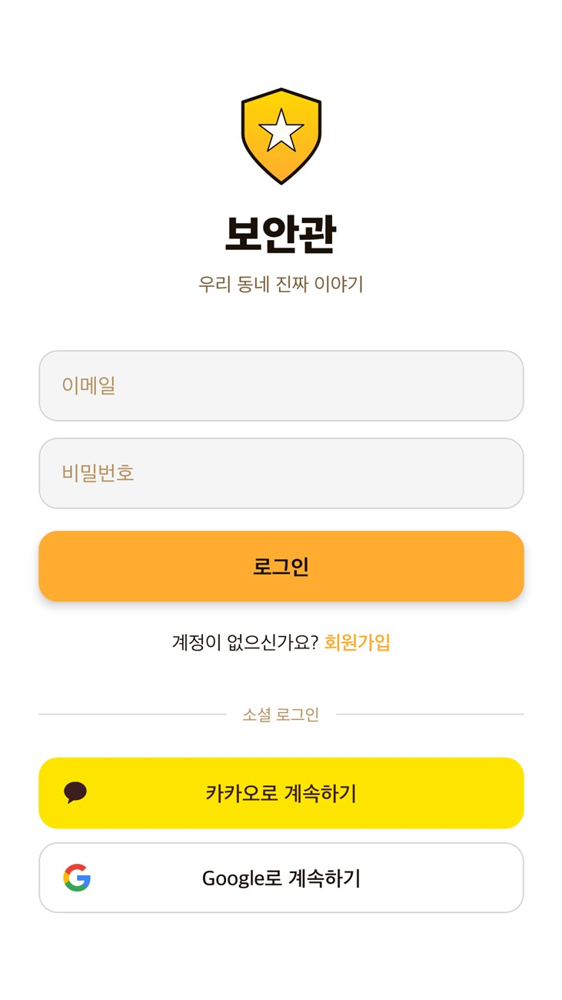
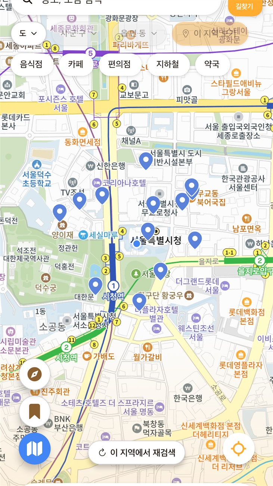
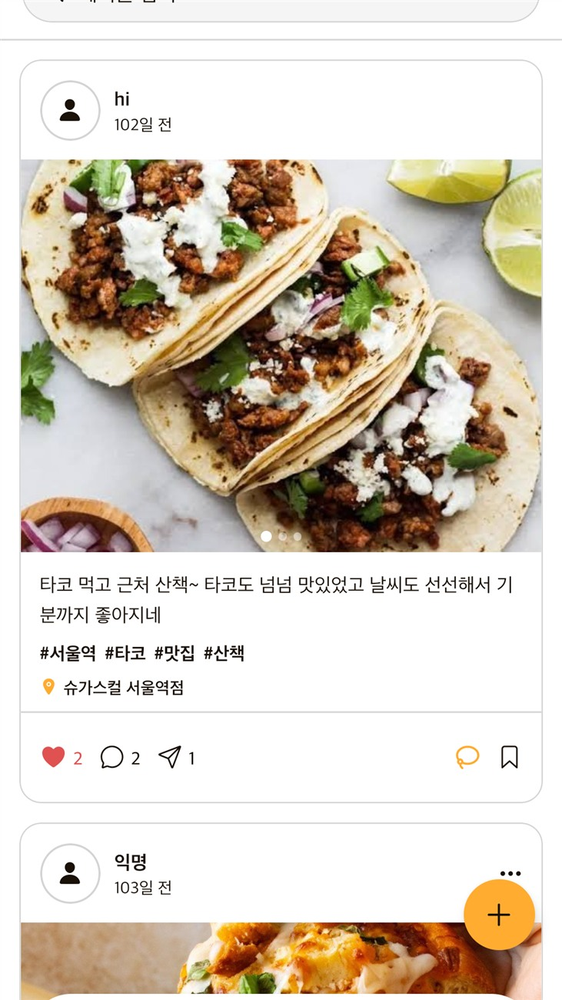
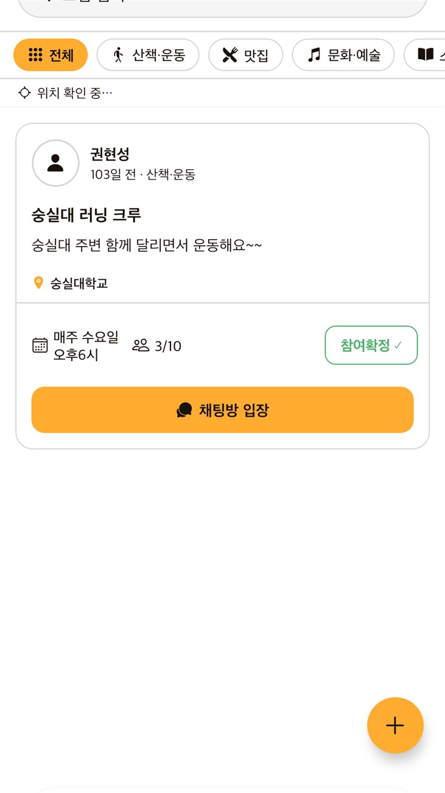
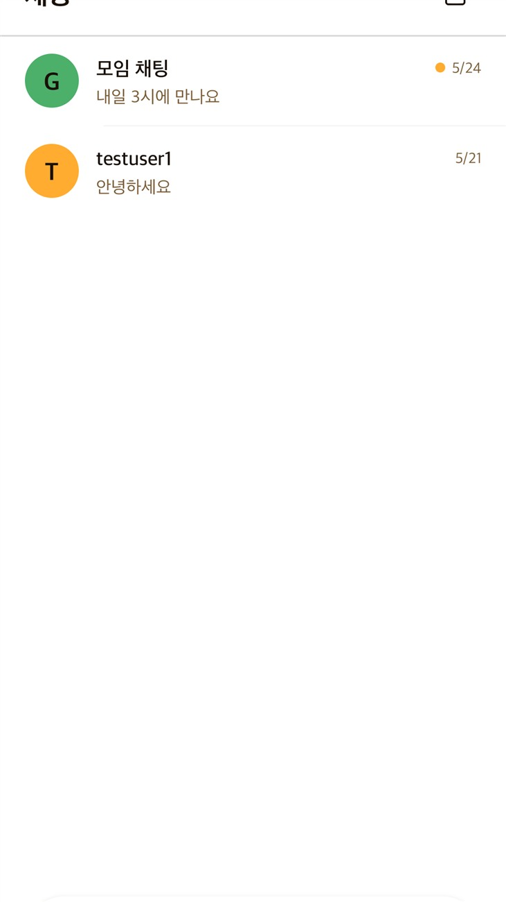
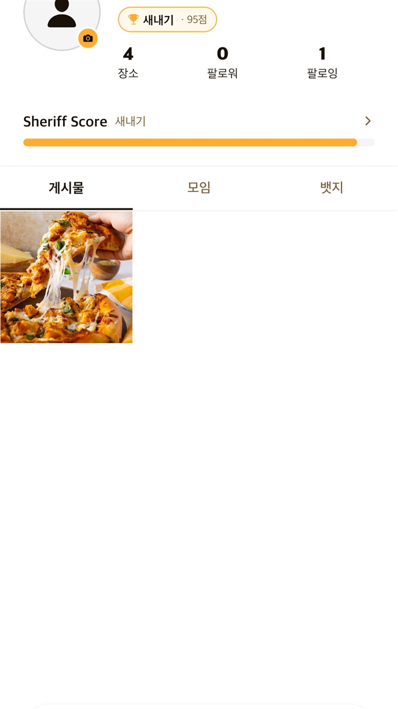

# 보안관 (Sheriff)

> 실시간 지도와 신뢰 기반 지역 활동 데이터를 결합한 하이퍼로컬 커뮤니티 SNS 앱

동네 모임 수요와 로컬 여행에 대한 관심을 겨냥해, **지도를 메인 화면**으로 두고 주민 추천 장소·게시물·모임을 연결합니다.
활동 점수가 쌓인 주민은 **보안관 뱃지**를 받고, 보안관이 추천한 정보는 신뢰도 높은 정보로 강조됩니다.

- 플랫폼: Android / iOS (React Native · Expo)
- 개발: 권현성 (소프트웨어학부) · 1인 풀스택 (기획 · 디자인 · 앱 · 서버리스 백엔드)
- 기간: 2026.03 ~ 2026.09 (MVP 2026.05, 원스토어 제출 대응 2026.09)

<p>
  
  
  
  
  
  
</p>

---

## 주요 기능

| 영역 | 내용 |
|------|------|
| **지도** | 카카오맵 기반 3가지 모드(기본 / 내 지도 / 모임), 장소 키워드·카테고리 검색, 1탭 핀 저장, TourAPI 주변 관광지, 자동차·대중교통·도보 길찾기 |
| **동네 연대기** | 같은 장소에 남긴 게시물 수에 따라 지도 마커가 깃발 → 이정표 → 집 → 호텔 → 빌딩으로 성장, 아직 안 가본 곳 위주의 코스 추천 |
| **피드** | 사진(최대 5장) · 해시태그 · 장소 태그 게시물, 좋아요 · 댓글 · 공유 · 북마크, 검색 |
| **모임** | 정기 모임 / 번개 모임(마감 시간), 거리순 목록, 참여 신청 → 호스트 승인·거절, 모임 채팅 |
| **채팅** | 1:1 DM, 모임 채팅, 읽지 않은 메시지 배지, 내 지도 공유 메시지 |
| **보안관 시스템** | 활동별 점수 · 6단계 등급 · 뱃지 11종, 매월 지역별 TOP 10 보안관 뱃지 자동 부여(Cloud Functions 스케줄러) |
| **인증 · 안전** | 이메일 / 카카오 / 구글 / 애플 로그인, 약관 · 위치정보 동의, 주거지 GPS 인증, 게시물 · 유저 신고, 차단 |
| **알림** | 모임 신청 · 승인 · 거절, 댓글 알림(앱 내 알림함) |

---

## 기술 스택

| 분류 | 기술 |
|------|------|
| App | React Native 0.81 · Expo SDK 54 · TypeScript (strict) · Expo Router |
| 상태 관리 | Zustand |
| 지도 | Kakao Map JS SDK (WebView 브리지) · Kakao Local / Mobility API · ODsay · 한국관광공사 TourAPI |
| Backend | Firebase Auth · Firestore · Storage · Cloud Functions v2 (`asia-northeast3`) · Hosting |
| 빌드 · 배포 | EAS Build |
| 테스트 | Jest (jest-expo) |

---

## 구현 포인트

- **카카오 로그인을 Firebase 인증으로 연결** — 앱에서 받은 카카오 토큰을 Cloud Function(`kakaoCustomToken`)이 서버에서 재검증한 뒤 Firebase Custom Token을 발급합니다. 신규 가입 시 약관 동의 여부도 서버에서 다시 확인합니다.
- **WebView ↔ React Native 메시지 브리지** — 카카오맵 JS SDK를 WebView에 띄우고, 마커 · 경로 · 모드 전환을 타입이 정해진 메시지로 주고받습니다. WebView로 넘기는 JSON과 텍스트는 이스케이프해 스크립트 삽입을 막았습니다.
- **API 키 보호와 호출 제한** — 길찾기(Kakao Mobility, ODsay)는 키를 서버에만 두고 Cloud Function으로 대신 호출하며, Firestore 트랜잭션 카운터로 유저당 하루 50회로 제한합니다.
- **추가 컬렉션 없는 연대기 집계** — 이미 구독 중인 게시물 데이터를 클라이언트에서 장소별로 묶어 랜드마크 등급을 계산합니다(`src/utils/postAggregation.ts`, 단위 테스트 포함).
- **비동기 응답 경쟁 처리** — 길찾기 요청마다 세대 토큰을 붙여, 늦게 도착한 이전 응답이 화면을 덮어쓰지 않게 했습니다.

---

## 프로젝트 구조

```
app/                    화면 (Expo Router, 파일 기반 라우팅)
├── (tabs)/             하단 탭: 지도 · 피드 · 모임 · 채팅 · 프로필
├── post/ gathering/ user/ shared-map/ dm/   상세 화면
├── login.tsx · signup.tsx · profile-setup.tsx
└── create-post.tsx · create-gathering.tsx · notifications.tsx
src/
├── api/                Firebase · 외부 API 호출
├── components/         공통 컴포넌트
├── store/              Zustand 스토어 (auth, map, post)
├── utils/              거리 계산, 연대기 집계
├── constants/          뱃지, 행정구역 데이터
└── types/
functions/src/          Cloud Functions (카카오 인증, 길찾기 프록시, 점수 · 월간 뱃지)
public/                 OAuth 리다이렉트 페이지 (Firebase Hosting)
firestore.rules · storage.rules
__tests__/              단위 테스트
docs/                   기능 명세 · 흐름도 · 스토어 등록 자료
```

---

## 실행 방법

```bash
npm install
cp .env.example .env   # 아래 환경 변수를 채워 넣습니다
npx expo run:android   # 개발 빌드 (expo-dev-client)
npm test               # 단위 테스트
```

**앱 환경 변수 (`.env`)**

| 변수 | 용도 |
|------|------|
| `EXPO_PUBLIC_KAKAO_REST_API_KEY` | 카카오 로그인 · 장소 검색 |
| `EXPO_PUBLIC_TOUR_API_KEY` | 한국관광공사 TourAPI |
| `EXPO_PUBLIC_ODSAY_API_KEY_ANDROID` / `_IOS` | 대중교통 길찾기 |
| `EXPO_PUBLIC_GOOGLE_ANDROID_CLIENT_ID` | 구글 로그인 |

**Cloud Functions 환경 변수 (`functions/.env`)** — `KAKAO_REST_KEY`, `ODSAY_API_KEY_ANDROID`, `ODSAY_API_KEY_IOS`

```bash
firebase deploy --only functions,firestore:rules,storage
eas build --platform android --profile production
```

---

## 문서

- [기능 명세서 (현행 구현 기준)](docs/기능-명세서.md) — 화면 · 데이터 모델 · 점수표 · 보안 규칙 · 알려진 한계
- [핵심 기능 흐름](docs/core-features-flow.md)
- [디자인 시스템](DESIGN.md)
- [개인정보처리방침](docs/store/privacy-policy.md) · [스토어 등록 정보](docs/store/listing-ko.md)

---

## 한계와 다음 단계

- 점수 · 뱃지 계산이 클라이언트 트랜잭션에 있어, 신뢰성을 위해 Cloud Functions로 옮길 예정입니다.
- 기획 단계의 퀘스트(도움 요청), 24시간 스토리, FCM 푸시 알림, 프로필 사진 변경은 아직 구현되지 않았습니다.
- 등급 상승 애니메이션, 친구 지도 나란히 비교, 동네 스카이라인 공유 이미지는 후속 과제입니다.

자세한 목록은 [기능 명세서 §9](docs/기능-명세서.md)에 정리되어 있습니다.
